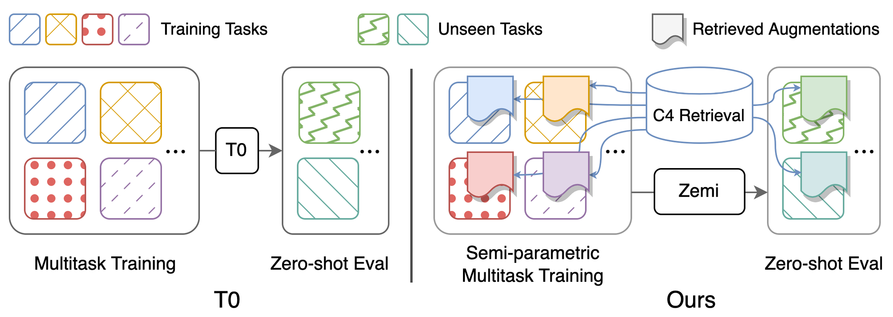

# Code for paper [Zemi: Learning Zero-Shot Semi-Parametric Language Models from Multiple Tasks](https://arxiv.org/abs/2210.00185)



## Prepare Datasets
Instructions on downloading preprocessed datasets and prepraring costum datasets can be found [here](./data/README.md)  

## Download Checkpoints
Download `checkpoints` from: https://uofi.box.com/s/wnt6cv7icuir4q3wb2a6viuyklme5dga. Put the checkpoints directories in `checkpoints` under `output/p3_finetuning`

## Setup Environment
Set up conda environment with `conda env create -f environment.yml`

## Quick Start
Scripts for reproducing the main results in Table 1: performing (semi-)parametric multitask prompted training and zero-shot evaluation. Detailed instructions on the configurations can be found [here](./zemi/training/README.md).
All scripts should be run under `zemi/`.  `SETUP_ENV.sh` will be called in the following scripts for setting up env variables. One may modify the variables if not using the exact same folder structure as setup above.

### No Aug baseline 
- base: `bash ./training/no_aug_base.sh`
- large: `bash ./training/no_aug_large.sh`
### Concat baseline
- base: `bash ./training/concat_base.sh`
- large: `bash ./training/concat_large.sh`
### FiD baseline
- base: `bash ./training/fid_base.sh`
- large: `bash ./training/fid_large.sh`
### Zemi
- base: `bash ./training/zemi_base.sh`
- large: `bash ./training/zemi_large.sh`

## Brief Description of the Source Code
- code for the model architecture: `zemi/modeling_t5.py`, `zemi/modeling_xattn.py`
- code for multitask training: 
    - train No Aug and Concat baseline: `zemi/multi_task_fine_tune_baseline.py`
    - train FiD baseline and Zemi: `zemi/multi_task_fine_tune_xattn.py`
- code for zero-shot evaluation: 
    - eval No Aug and Concat baseline: `zemi/eval_original_task_only.py`
    - eval FiD baseline and Zemi: `zemi/eval_original_task_only_xattn.py`

## Citation
```
@article{wang2022zemi,
  title={Zemi: Learning Zero-Shot Semi-Parametric Language Models from Multiple Tasks},
  author={Wang, Zhenhailong and Pan, Xiaoman and Yu, Dian and Yu, Dong and Chen, Jianshu and Ji, Heng},
  journal={arXiv preprint arXiv:2210.00185},
  year={2022}
}
```
